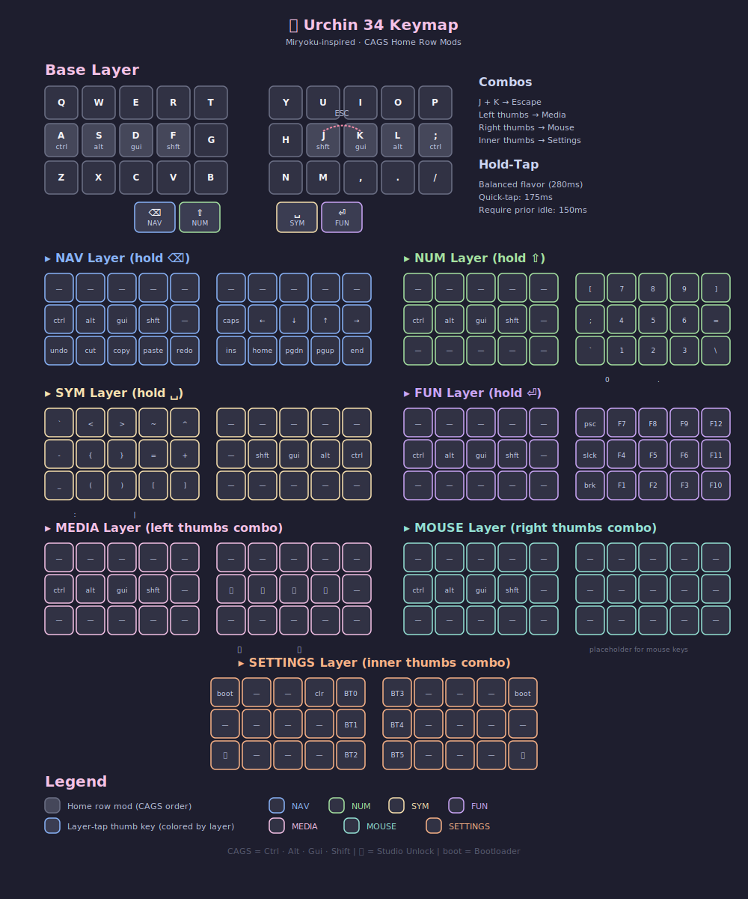

Firmware for: [Urchin Keyboard](https://github.com/duckyb/urchin)

## Getting started

**Are you trying to make your own ZMK firmware?**  
[Here are the steps you need to take.](./GETTING_STARTED.md)

**Do you want to download my keymap?**  

[here](https://github.com/cassiechew/urchin-zmk-firmware/actions/workflows/build.yml)

## Keymap Cheat Sheet

 

